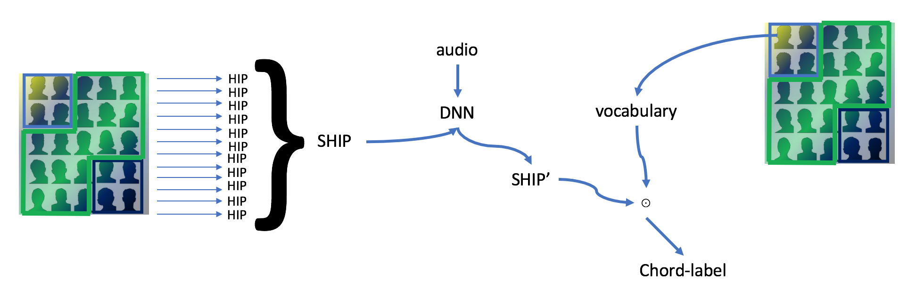
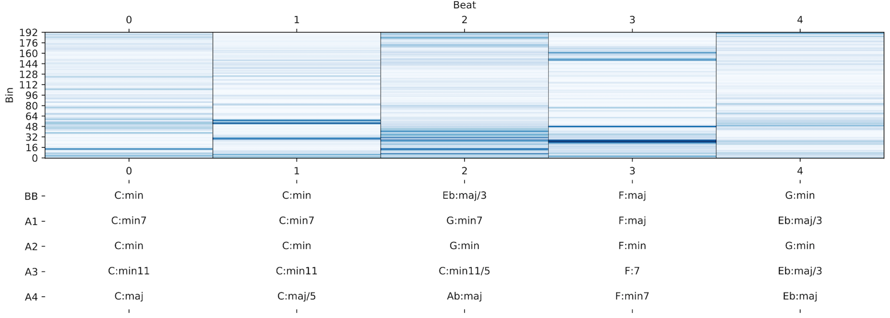
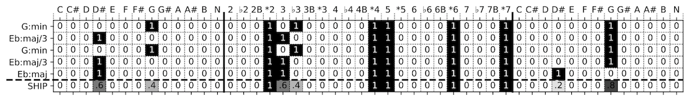
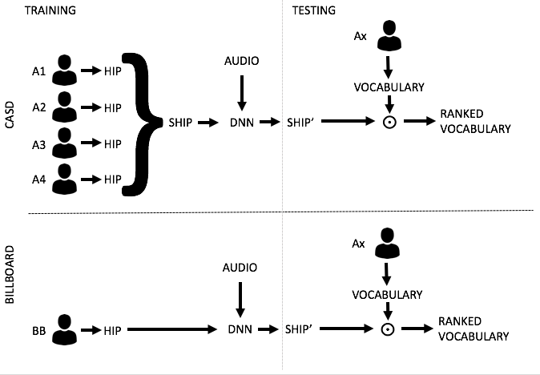

# Chord Label Personalization through Deep Learning of Integrated Harmonic Interval-based Representations #



This project hosts the code for our [[**Deep Learning for Music@IJCNN 2017**]](http://dorienherremans.com/dlm2017/) conference paper and an extended journal paper at [[**Neural Computing and Applications**]](http://link.springer.com/article/10.1007/s00521-018-3703-y). 

The increasing accuracy of automatic chord estimation systems, the availability of vast amounts of heterogeneous 
reference annotations, and insights from [[annotator subjectivity research]](http://www.cs.uu.nl/research/techreps/repo/CS-2017/2017-018.pdf) make chord label personalization increasingly 
important. Nevertheless, automatic chord estimation systems are historically exclusively trained and evaluated on a 
single reference annotation. We introduce a first approach to automatic chord label personalization by modeling 
subjectivity through deep learning of a harmonic interval-based chord label representation. After integrating these 
representations from multiple annotators, we can accurately personalize chord labels for individual annotators from 
a single model and the annotators' chord label vocabulary. Furthermore, we show that chord personalization using 
multiple reference annotations outperforms using a single reference annotation. 

## Reference

If you want to reference this research, please refer to the following papers.

```
@article{koops2018automatic,
  title={Automatic chord label personalization through deep learning of shared harmonic interval profiles},
  author={Koops, Hendrik Vincent and de Haas, W Bas and Bransen, Jeroen and Volk, Anja},
  journal={Neural Computing and Applications},
  pages={1--11},
  year={2018},
  publisher={Springer}
  url={https://doi.org/10.1007/s00521-018-3703-y}
}
```

```
@INPROCEEDINGS{2017dlm..conf...19K,
    author = {{Koops}, H.~V. and {de Haas}, W.~B. and {Bransen}, J. and {Volk}, A.},
    title = "{Chord Label Personalization through Deep Learning of Integrated Harmonic Interval-based Representations}",
	booktitle = {Proceedings of the First International Conference on Deep Learning and Music, Anchorage, US, May, 2017., pp.19-25},
    year = 2017,
	archivePrefix = "arXiv",
    eprint = {1706.09552},
	primaryClass = "cs.SD",
    month = may,
    pages = {19-25}
}
```
https://arxiv.org/abs/1706.09552

## Examples

The figure below provides an example of the disagreement between the annotations from annotators A1, A2, A3, A4 from the [[CASD]](http://www.github.com/chordify/casd) and the annotation from the [[Billboard]](http://ddmal.music.mcgill.ca/research/billboard) (BB). The figure shows Constant-Q features calculated from audio and the corresponding chord labels from the BB and the CASD. The figure shows that annotators disagree with each other on the level of root notes (e.g. G and C in beat 2), intervals (e.g. C:min and C:min11 in beat 0 and 1), and bass notes (e.g. Eb:maj and Eb:maj/3 in beat 4).

If you are interested in a detailed analysis of the annotator subjectivity found in the CASD, please find our technical report: 

Koops, H.V., de Haas, W.B., Burgoyne, J.A., Bransen, J., Volk, A.: [*"Technical Report: Harmonic Subjectivity in Popular Music."*](http://www.cs.uu.nl/research/techreps/repo/CS-2017/2017-018.pdf) Tech. Rep. UU-CS-2017-018, Department of Information and Computing Sciences, Utrecht University (2017)



For the goal of chord label **personalization**, we propose to use a new representation that captures a harmonic interval profile (HIP) of chord labels, instead of the common approach of directly learning a chord-label classifier. The rationale behind the HIP is that most chords can be reduced to the root note and a set of intervals relative to the root, where the amount and combination of intervals determines the chord quality and possible extensions. The HIP captures this intuition by reducing a chord label to its root note, interval profile and bass note.

To capture the harmonic content shared among different HIP, we we create a Shared Harmonic Interval Profile (SHIP) by computing the column-wise arithmetic mean of multiple HIPs. The last row of the figure below shows an example of the SHIP created from the HIPs above it. By averaging, we create a fuzzy chord representation: the SHIP essentially contains a concatenation of probability density functions for the root, bass and each stacked intervals. These probability density functions express the average harmonic content shared among the annotators’ chord labels. Instead of the classical ACE approach of trying to estimate just a single chord label, we propose to estimate this fuzzy representation from audio.



The SHIP features are used to rank the chord labels from an annotators' vocabulary. In an experiment we compare training of our chord label personalization system on multiple reference annotations from the CASD with training on a commonly used single reference annotation from the Billboard dataset.



Our results show that up to 10% better chord labels per user can be provided when taking into account multiple reference annotations. Personalization using only the commonly used Billboard annotation yields significantly worse results per annotator. Furthermore, poor personalization results using the common chroma representation shows that, in contrast to chroma, SHIP is capable of capturing the shared harmonic content needed for personalization.

## Note

Due to copyright issues, this repository does not contain the audiofiles nor the constant-q features to run the experiment.

## Acknowledgement

We thank Y. Ni, M. McVicar, R. Santos-Rodriguez and T. De Bie for providing their dataset.

```
@article{ni2013understanding,
  title={Understanding effects of subjectivity in measuring chord estimation accuracy},
  author={Ni, Yizhao and McVicar, Matt and Santos-Rodriguez, Raul and De Bie, Tijl},
  journal={IEEE Transactions on Audio, Speech, and Language Processing},
  volume={21},
  number={12},
  pages={2607--2615},
  year={2013},
  publisher={IEEE}
}
```

## Authors

[Hendrik Vincent Koops](https://www.uu.nl/staff/HVKoops), [Anja Volk](http://www.cs.cmu.edu/~gunhee/) 
@ Department of Information and Computing Sciences, Utrecht University, Utrecht, the Netherlands

[W. Bas de Haas](http://www.chordify.net/), [Jeroen Bransen](http://www.chordify.net/) 
@ Chordify, Utrecht, the Netherlands
